# Chat dialogs labelling - Final project Text Mining

# Objetivo

Dado un conjunto de textos proveniente de una conversación queremos identificar y etiquetar temas que se fueron hablando en distintas secciones del chat.

Por ejemplo: Supongamos que al programa (Clasificador), le damos como entrada una conversación entre 2 personas. El objetivo es que podamos obtener de una manera visual las secciones con etiquetas de los diferentes temas hablados en esa conversación.

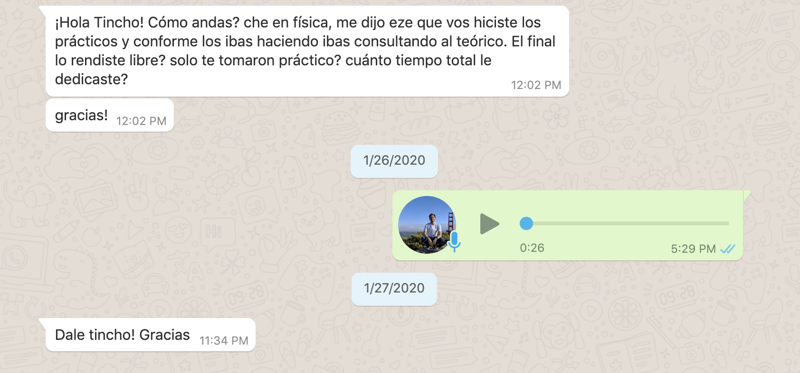

En la imagen anterior podemos ver un ejemplo de una conversacion, lo que nosotros esperamos es que el modelo pueda identificar esta parte de la conversación con temas relacionados a la universidad, estudio, etc.

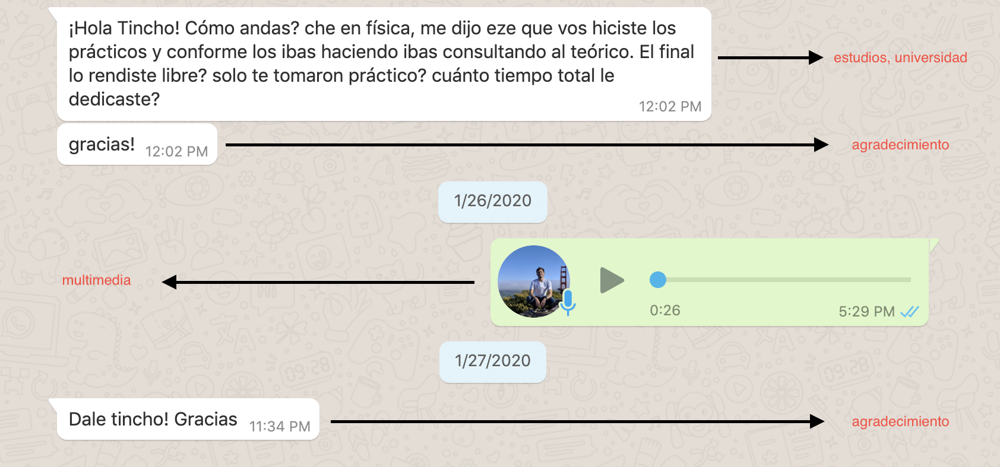

# Aproximación al problema

Cuestiones para tener en cuenta en el proyecto es que las etiquetas van a estar fijas y van a ser en base al corpus de entrenamiento. Este corpus de entrenamiento debe ser generado a partir de conversaciones personales.

El primer paso en el proyecto es la obtención del Corpus. Este paso se dificulta por el hecho de que las conversaciones son personales. Una forma de obtener chats fue recolectar conversaciones de grupos de whatsapp y chats propios.

La idea del approach es de utilizar un corpus para etiquetar conversaciones y con esos ejemplos ya etiquetados poder entrenar un clasificador. La forma de etiquetar estas conversaciones que luego se usaran para entrenar el clasificador es a partir de un algoritmo de clustering en el cual a partir de los elementos de cada cluster, se generaliza el tema y se usa esa etiqueta para cada elemento de ese cluster.

Se tiene que destacar que la mayor parte del proyecto consiste en generar estos ejemplos para el clasificador, ya que de esto dependera gran parte la calidad de las predicciones.


# Diagrama de flujo

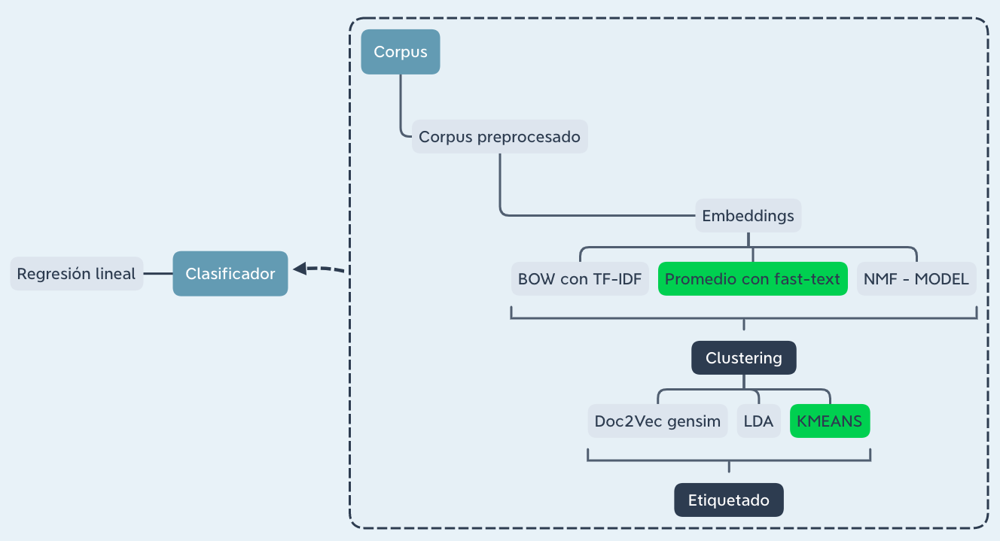

## Preprocesamiento

El objetivo de este paso es normalizar el corpus. Este paso nos permitira obtener mejores resultados en las siguientes etapas, es una parte crítica para el proyecto. Dentro de las acciones realizadas tenemos:

* Creación de unidad, los cuales son conjuntos de mensajes enviados sin interrupción por un mismo usuario, con un threshold de X minutos (En nuestro caso se utilizó 10 minutos). 
* Normalizar palabras utilizando expresiones regulares. Las acciones fueron las siguientes:
* Eliminar caracteres repetidos. **Ejemplo** 'holaaaa' por 'hola'
* Omitir media
* Remplazo de abreviaciones por la palabra completa. **Ejemplo** 'hno' por 'hermano'.
* Remover palabras especificas. 
* Remover stopwords, dígitos y palabras con menos de **3** caracteres.
* Remover palabras que aparecen menos de **8** veces en todo el corpus.
* Lematización. Este paso nos permite remplazar palabras por su raiz. **Ejemplo** 'corriendo' por 'correr'
    * Se utilizó el siguiente [repo](https://github.com/pablodms/spacy-spanish-lemmatizer) ya que se desempeña mejor que el default de spacy.
*  Remover unidades con menos de Y palabras (Luego del preprocesamiento anterior).


## Embeddings

A lo largo del proyecto se probaron distintos tipos de embeddings que pudieran ser útiles. Luego de muchas pruebas y se decidió continuar con *fasttext* ya que dió los mejores resultados de forma visual. Se adjuntan de todas formas los códigos de los otros 2 embeddings en caso de que alguien quiera experimentar con llos.

#### BAG con TF-IDF
Para este embeddings se calculara un modelo para así poder comparar con FastText que es nuestro modelo eligido para el proyecto.

#### Doc2Vec gensim
Para este embeddings se calculara un modelo para así poder comparar con FastText que es nuestro modelo eligido para el proyecto.

#### Promedio con embeddings con fastText (uso de subwords)
Por lejos el método que nos dió el mejor resultado. Hay que destacar para obtener la mejora de estos se uso el parametro `sg=1` el cual nos indica que el entrenamiento del modelo se realizara con `skip-gram`. Este cambio mejoro de forma drastica a la version del modelo con parametro `sg=0` el cual indica un entrenamiento con `CBOW`.

Otros parametros relevantes fueron:
* `size`: El cual indica las dimensiones del modelo.
* `window`: cantidad de palabras a izquierda y a derecha en el contexto de cada palabra.
* `epochs`: Numero de iteraciones.

Para elegir estos parametros se calcularon modelos con combinaciones predefinidas y se evaluó cual daba mejores resultados.

Se decidió utilizar el modelo con los siguientes parametros:
* `size: 12`
* `window: 4`
* `epochs 50`

Visualización en 2 dimensiones del modelo a utilizar

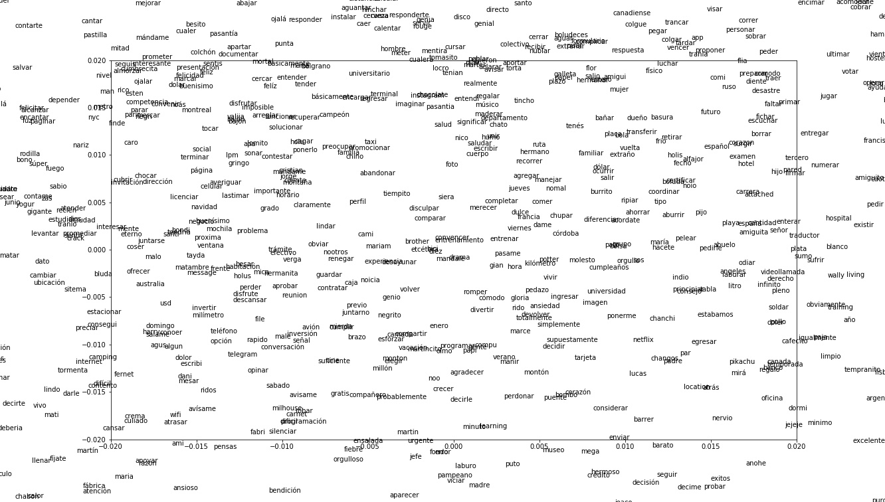

Algunos ejemplos de palabras mas similares utilizando el modelo mencionado

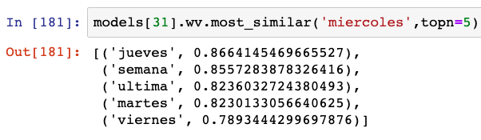
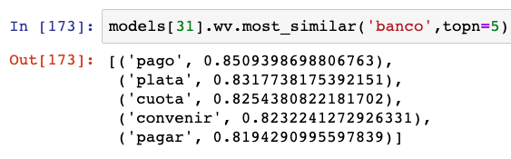
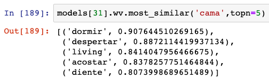


## Clustering

Al igual que con la parte de embeddigs, para clustering se tomo la decision de proseguir con K-MEANS, de todas formas se adjunta un *code snipet* de LDA junto con una captura de los topicos obtenidos por parte de este algoritmo.

#### LDA

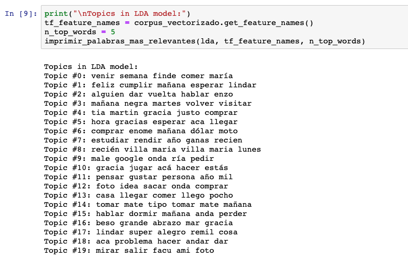

#### K-MEANS

En este paso debemos obtener una lista de topics que representaran a nuestro corpus. La idea es de clusterizar a nuestras unidades y luego analizar los clusters obtenidos para obtener `labels` que representaran al topico de cada uno de estos clusters.

Como k-means depende del parametro `K` se utilizó el metodo elbow para tener una idea de que valor tomar.

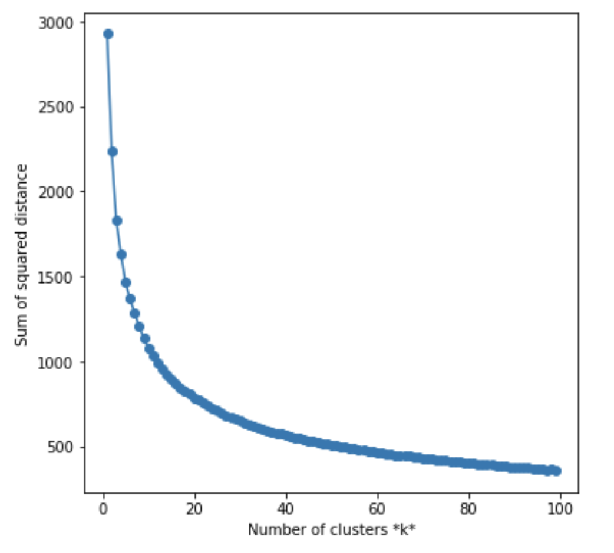

Como se puede observarse, tenemos el `elbow` rondando el valor 15. Luego de algunas pruebas se decidió usar el valor 12.
A continuación se pueden ver los 12 clusters con las 15 palabras más significativas.

```
ID cluster:  0
bono plazo dólar sueldo fijo tienda marca peso usd naruto temporada dolares compro compra btc 

ID cluster:  1
bebe agarro telegram peli lavar maico acostado recien cama conectar colgar gordi dormido termino escribi 

ID cluster:  2
felíz navidad feliz cumpleaños pase cumplir deseo rida festejar mándale alma rido familia hermanita nacho 

ID cluster:  3
birra tomamos vayamos planta depto fideo invitado plato papas asar dani costa birras the come 

ID cluster:  4
felicitar mándame egreso felicito mega genia verte irte crack hermanita lisboa luisin tin extraño alegro 

ID cluster:  5
maria viene villa tio abuelo candar fano tia cande nacho maría ratito abu visitar directo 

ID cluster:  6
colchón caracu tomasito nobres nico gloria dobby oreo opinar leche factura gonza toma ariel javi 

ID cluster:  7
unidos casco tramite vegas turno miami vuelo carnet contrato paga angeles depositar canada pasaje visa 

ID cluster:  8
consejo reunion nueve jueves miercoles cocino parcial limpiar martes brother training miércoles rendir larva limpio 

ID cluster:  9
lpm lado zarpado montaña risa museo lugar pija cuerpo pedazo alto indio jazz anime pinto 

ID cluster:  10
cuídate beso descanses gigante bendición enome fuerte besito cuidate logro mar regreso chau abrazo campeón 

ID cluster:  11
firma traductor facebook intentar perfil file attached hacerme latam hacerte mostrar inglés nervio correr pasantia 
```

Por lo que se los etiqueto de esta forma
```
ID cluster: 0 - Dinero | Finanzas
ID cluster: 1 - Dormir
ID cluster: 2 - Cumpleaños | Navidad
ID cluster: 3 - Juntada | Comida
ID cluster: 4 - Felicitaciones por logro
ID cluster: 5 - Familia | Villa Maria
ID cluster: 6 - Personas del CMU
ID cluster: 7 - Tramites | Viajes
ID cluster: 8 - Responsabilidades | CMU
ID cluster: 9 - Bardo | Otros
ID cluster: 10 - Saludo | Despedida
ID cluster: 11 - Archivos | Tramites pasantia
```


## Clasificador

Para la clasificación de las unidades ('oración en la conversación') utilizamos un modelo de regresión logística de la libreria `sklearn`.

En `logistic_regression_functions` tenemos definidos los parametros y demases relevantes al modelo.

El clasificador se entrena con el conjunto de datos que hemos pre_procesado y utlizado en la parte del clusterizado y se le provee además las etiquetas correspondientes a los clusters que recibio cada dato.

Una vez entrenado nuestro modelo, escribimos en archivos el `modelo` y el `feature_transform` que seran utilizados posteriormente.

El clasificador entrenado nos devolvio los siguientes indicadores:

```
Accuracy=0.9313640312771503; 
MRR=0.9378801042571678
```

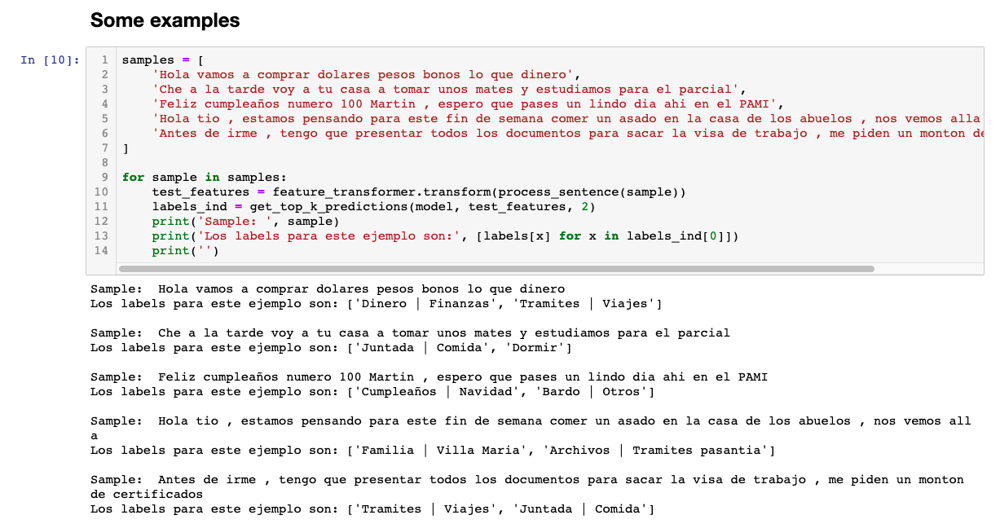


# Datos de ejemplo

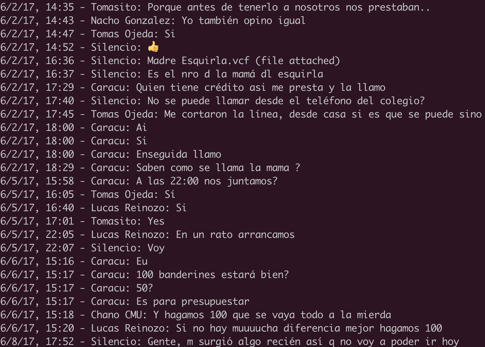

- Aca se muestra una captura del corpus antes del procesamiento. 


# Demo

El notebook demo nos permite, una vez creados los modelos y los datos necesarios. Poder correr ejemplos de conversaciones y así obtener el valor de la etiqueta predicha.

Dentro del directorio `demo/` de este mismo repositorio se pueden encontrar algunos ejemplos. Estos mismos dieron como resultados:

```
Mensaje preprocesado:

[['financiarno', 'peso', 'depende', 'agencia', 'cubrir', 'subido', 'dolar', 'barato']]

Predicciones:
Dinero | Finanzas
-------------------- FIN EXAMPLE DEMO --------------------

Mensaje preprocesado:

[['tincho', 'andas', 'física', 'eze', 'vos', 'hacer', 'práctico', 'conforme', 'ibas', 'ibas', 'consultar', 'teórico', 'rendir', 'libre', 'tomar', 'práctico', 'dedicar', 'gracia']]

Predicciones:
Responsabilidades | CMU
-------------------- FIN EXAMPLE DEMO --------------------

Mensaje preprocesado:

[['dani', 'pensar', 'cumbrecita', 'semana', 'res', 'cordoba', 'buscar', 'vos', 'junto', 'idea', 'alla', 'volver', 'nohe']]

Predicciones:
Juntada | Comida
-------------------- FIN EXAMPLE DEMO --------------------

Mensaje preprocesado:

[['problema', 'corona', 'virus', 'vuelo', 'cancelar', 'ningun', 'recibir', 'viajes', 'exterior', 'esperar', 'aerolineas', 'permitir', 'viajar', 'nuevamente']]

Predicciones:
Tramites | Viajes
-------------------- FIN EXAMPLE DEMO --------------------

Mensaje preprocesado:

[['feliz', 'fiesta', 'ero', 'sepan', 'ero', 'ria', 'darles', 'gracia', 'mensaje', 'escrito', 'corazón', 'copiar', 'pegar', 'epo', 'handball', 'desear', 'abrazo', 'fuerte', 'feliz', 'navidad', 'prospero', '2015']]

Predicciones:
Cumpleaños | Navidad
-------------------- FIN EXAMPLE DEMO --------------------
```

# Desafios

* Diferentes dominios

* Palabras mal escritas

* Palabras personalizadas

* Mensajes en multimedia que son parte de la conversacion

* Donde empieza y termina un tema no esta formalmente definido

* Corpus pequeño debido a que el corpus es de caracter personal por lo que dificulta la obtencion de ejemplos por temas de privacidad.

* No existe una unica etiqueta que englobe a la conversación.

* El pipeline tenia demasiadas etapas. A su vez dentro de cada etapa habia diferentes variantes.


# Conclusiones

En el siguiente proyecto se pudo ver de una forma end-to-end el proceso de creación de un proyecto de mineria de datos. Desde el planteo del problema e idea de solución, hasta la ejecución de esta en los diferentes pasos como la obtención del corpus, su pre-procesamiento, las visualizaciones de los datos, la formas de evaluar la presición del mismo y como asi tambien lograr un prototipo.

Este formato de proyecto no solo permite aplicar las tecnicas y algortimos obtenidos en la materia, sino tambien entrenar otros aspectos como:
* Definicion y alcance de un proyecto. 
* Estructura de codigo y archivos.
* Investigacion de proyectos similares para obtener ideas y soluciones a cuestiones que se presentan.


# Trabajo a futuro

* Corpus más grande y especificos del lenguaje, (se puede incluir tweets en español de temas especificos para mejorar el corpus.)

* Investigar con Sent2Vec de gensim

* Adaptar LDA para hacer comparaciones con el estado actual.

* Extender y mejorar los labels de las predicciones.

# Instalacion y uso

Instalación de requerimientos

`pip3 install -r requirements.txt`

El uso depende de los datos y modelos con los que ya se cuenta debido a que es posible recuperar pasos anteriores a travez de la carga de archivos.

Para un uso desde cero. Los pasos serian los siguientes.
Actualizar el path dentro de `paths.ipynb` con la ruta al proyecto y tambien con la ruta a los archivos del corpus. Luego:

* Correr el notebook `1 - Preprocessing.ipynb`
* Correr el notebook `2 - MEAN of Vectors with FastText.ipynb`
* Correr el notebook `3 - K-MEANS.ipynb`
* Correr el notebook `4 - Logistic Regression models.ipynb`
* Correr el notebook `DEMO.ipynb`

# Referencias

- [Referencias de la propia materia.](https://sites.google.com/view/text-mining-2019/materiales?authuser=0)
- [Preprocesado de corpus](https://kavita-ganesan.com/text-preprocessing-tutorial/#.XjU0mhMzYmp)
- [Word2Vec y FastText Word Embedding en Gensim](https://towardsdatascience.com/word-embedding-with-word2vec-and-fasttext-a209c1d3e12c)
- [Introduccion a Doc2Vec](https://medium.com/wisio/a-gentle-introduction-to-doc2vec-db3e8c0cce5e)
- [Topic modelling](https://nlpforhackers.io/topic-modeling/)
- [Curso de NLP de stanford](http://web.stanford.edu/class/cs224u/)
- [Clasificador con regresion logistica](https://kavita-ganesan.com/news-classifier-with-logistic-regression-in-python/#.XjPCehMzYmo)
- [Regresion logistica en python](https://towardsdatascience.com/logistic-regression-using-python-sklearn-numpy-mnist-handwriting-recognition-matplotlib-a6b31e2b166a)
- [K-Means clustering, EVALUATION](https://towardsdatascience.com/k-means-clustering-algorithm-applications-evaluation-methods-and-drawbacks-aa03e644b48a)
- [Distributed Representations of Sentences and Documents](https://arxiv.org/abs/1405.4053)
- [Topic discovery](https://medium.com/@b.terryjack/nlu-topic-discovery-85b492c4beb7)
